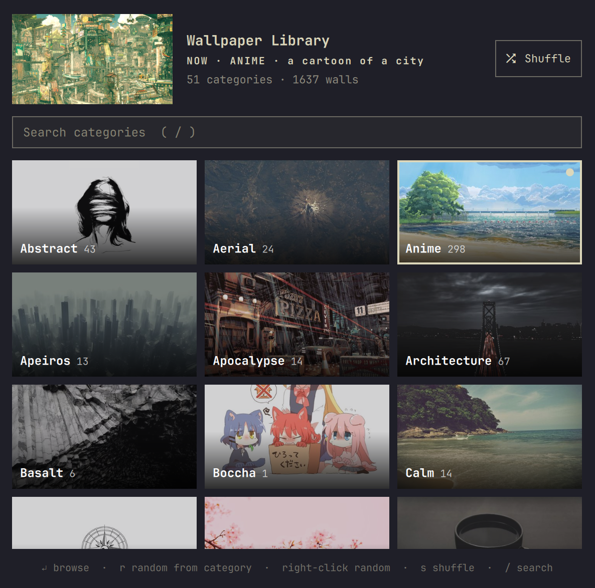

# Wallpaper Library

Browse a big, categorized wallpaper collection from the Omarchy bar. Each
category gets a cover tile; pick one to open Omarchy's image picker on it, or
grab a random wallpaper from a category or the whole library.

Built around [**dharmx/walls**](https://github.com/dharmx/walls), but works
with any folder that has one subfolder per category.



## Features

- **Category grid** with cover images and wallpaper counts, plus a preview of
  your current wallpaper. Its category is marked with an accent border and dot.
- **Image picker per category** using Omarchy's own picker, so selecting a
  wallpaper works exactly like *Style › Background*.
- **Random picks** from one category or the whole library.
- **Search and keyboard navigation**.
- **Guided download** of only the dharmx/walls categories you want (the full
  collection is several GB).
- Optional **Style › Wallpaper Library** submenu in the Omarchy menu.

## Install

```
omarchy plugin add https://github.com/jacueblol/omarchy-wallpaper-library
```

Enable it when asked (or later with
`omarchy plugin enable io.github.jacueblol.wallpaper-library`) and the icon
appears in the bar.

### Get wallpapers

Open the panel. If there's no library yet, click **Download wallpapers**: a
terminal opens where you tick the dharmx/walls categories you want, and only
those are downloaded to `~/.config/omarchy/wallpapers/dharmx-walls`. Run it
again from the same button (or `wallpaper-library download`) to add or remove
categories.

Already have wallpapers? Set the widget's **Library folder** setting to any
folder containing one subfolder per category.

### Optional: Style menu entry

```
~/.config/omarchy/plugins/io.github.jacueblol.wallpaper-library/wallpaper-library install-menu
```

This adds *Style › Wallpaper Library* to the Omarchy menu, with a row per
category and a Random row. It edits
`~/.config/omarchy/extensions/omarchy-menu.jsonc`, only between its own
marker comments, and saves a timestamped backup first. Nothing is added to the
menu unless you run this. Rerun it after adding categories.

## Using it

| Action | Mouse | Keyboard |
|---|---|---|
| Browse a category in the image picker | click a tile | arrows / `hjkl`, then `Enter` |
| Random wallpaper from a category | right-click a tile | `r` |
| Random wallpaper from the whole library | **Shuffle** | `s` |
| Search categories | click the search box | `/` (`Enter` opens the first match, `Esc` clears) |
| Close | click outside | `Esc` |

The same actions are available from a terminal:

```
wallpaper-library list | pick <category> | random [category] | download | install-menu | uninstall-menu
```

## Remove

```
~/.config/omarchy/plugins/io.github.jacueblol.wallpaper-library/wallpaper-library uninstall-menu   # only if you ran install-menu
omarchy plugin remove io.github.jacueblol.wallpaper-library
rm -rf ~/.cache/omarchy/wallpaper-library                                                   # cover thumbnails
```

Downloaded wallpapers stay in `~/.config/omarchy/wallpapers/dharmx-walls`;
delete that folder too if you don't want them.

## Dependencies

Everything it uses already ships with Omarchy: `jq`, `libvips`
(`vipsthumbnail`, for cover images), `git` and `gum` (download only),
`libnotify`, and the Omarchy commands `omarchy-menu-images` and
`omarchy-theme-bg-set`.

No sudo, no background services, and no network access except when you run
the download.

## Notes

- Categories open one at a time because Omarchy's image picker receives its
  whole list in one argument, which Linux caps at 128 KB. A category with
  more than roughly 500 images can exceed that; you'll get a notification
  saying so. Split such folders into smaller ones.
- Cover images are cached in `~/.cache/omarchy/wallpaper-library/`.

## Credits

Wallpapers come from [dharmx/walls](https://github.com/dharmx/walls), a
community-collected set; the images belong to their original artists. None
are included in this repository. The preview screenshot shows a few of them
as thumbnails.

## License

[MIT](LICENSE)
